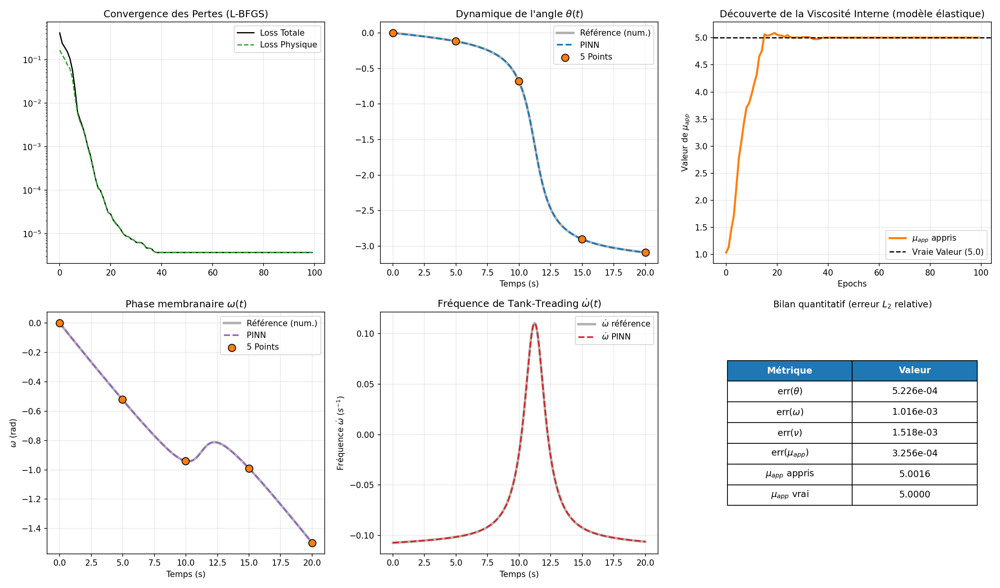
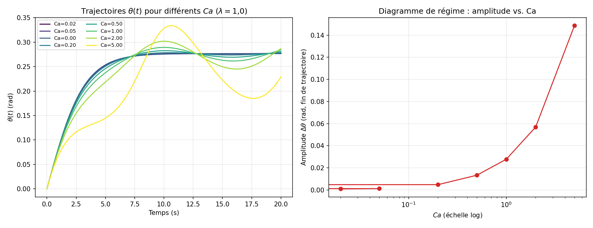

# Physics-Informed Neural Networks for Red Blood Cell Dynamics

Solving **direct and inverse problems** for the motion of a red blood cell in shear flow with Physics-Informed Neural Networks (PINNs), with the goal of estimating cell rigidity from a few observations.

Master's internship project — M1 Modélisation et Analyse Numérique (MANU), Université de Montpellier, 2025–2026.
Supervised by Vanessa Lleras and Simon Mendez (IMAG).

## Motivation

A healthy red blood cell is highly deformable. In pathologies such as sickle cell disease, it becomes rigid, which increases the viscosity ratio $\lambda = \mu_{app}/\mu$ and the risk of vaso-occlusion. In shear flow, this ratio determines the regime: a stable orientation (*tank-treading*) or periodic rotation (*tumbling*).

$\mu_{app}$ is hard to measure in vivo. This project shows that a PINN can **recover it from only 5 observations** of the cell's trajectory.

## Models

**Keller–Skalak (1982)**: a single ODE for the inclination angle $\theta(t)$:

$$\frac{d\theta}{dt} = A + B\cos(2\theta), \qquad A = -\tfrac{1}{2}\kappa$$

The sign of $A + B$, controlled by $\lambda$, separates the stationary regime from the tumbling regime.

**Elastic membrane (Abkarian 2007, Skotheim & Secomb 2007)**: adds membrane shear elasticity through a coupled system for $\theta(t)$ and the membrane phase $\omega(t)$:

$$\dot\theta = A + B\cos(2\theta) - C_c \dot\omega, \qquad \dot\omega = \kappa D_v\left[\cos(2\theta) - \frac{f_1}{2f_3}\frac{\Omega}{V}  Ca \sin(2\omega)\right]$$

where $Ca = G/(\mu_o\kappa)$ is the capillary number. This model captures *swinging*, which pure Keller–Skalak cannot. With $Ca = 0$, it reduces exactly to Keller–Skalak.

## Method

A fully connected network $t \mapsto \theta_{pred}(t)$ (3 hidden layers, 32 neurons, tanh activation) is trained with L-BFGS on a composite loss:

$$\mathcal{L} = w_{ic} \mathcal{L}_{ic} + w_{data} \mathcal{L}_{data} + w_{phys} \mathcal{L}_{phys}$$

The physics residual is computed exactly with automatic differentiation. For the **inverse problem**, $\mu_{app}$ becomes a trainable parameter optimized jointly with the network weights. For the elastic model, the reference solution is computed with `scipy.integrate.solve_ivp` (RK45, `rtol=1e-9`).

## Results

All results use **only 5 data points** on $t \in [0, 20]$ s.

| Problem | Model | Case | Relative $L_2$ error on $\theta$ | Result |
|---|---|---|---|---|
| Direct | Keller–Skalak | $\lambda = 1$ (stationary) | 3.0e-04 | — |
| Direct | Keller–Skalak | $\lambda = 5$ (tumbling) | 2.2e-04 | — |
| Inverse | Keller–Skalak | true $\mu_{app} = 5$, init. 1 | 7.0e-04 | $\mu_{app} = 4.9948$ |
| Inverse | Keller–Skalak | true $\mu_{app} = 1$, init. 5 | 1.2e-03 | $\mu_{app} = 1.0015$ |
| Inverse | Elastic | true $\mu_{app} = 5$, init. 1 | 5.2e-04 | $\mu_{app} = 5.0016$ |
| Inverse | Elastic | true $\mu_{app} = 1$, init. 5 | 8.9e-03 | $\mu_{app} = 1.0007$ |

In every case, the network recovers the viscosity with a relative error below 0.2%, starting from a wrong initial guess in either direction.

<p align="center">
  
</p>

<p align="center">
  
  <br><em>Effect of the capillary number Ca on the dynamics (λ = 1): higher elasticity produces stronger swinging.</em>
</p>

## Repository structure

```
notebooks/
├── 01_keller_skalak.ipynb             # Keller–Skalak: direct and inverse problems
└── 02_keller_skalak_elastique.ipynb   # Elastic model: consistency test, regimes, Ca sweep, inverse problem
figures/                               # Result figures
results/metriques_tests.txt            # Error metrics
```

## Usage

```bash
git clone https://github.com/marwane-tchabanna/pinns-red-blood-cell-dynamics.git
cd pinns-red-blood-cell-dynamics
python3 -m venv .venv && source .venv/bin/activate
pip install -r requirements.txt
jupyter notebook
```

## Limitations and perspectives

- Sensitivity of the tumbling regime to the placement of data points.
- Identifiability of $\mu_{app}$ versus $G$ in the elastic model, to be tested with noisier or sparser data.
- Extension to truly deformable shapes and oscillating shear flows.

## References

- Raissi, Perdikaris & Karniadakis (2019). Physics-informed neural networks. *J. Comput. Phys.* 378, 686–707.
- Keller & Skalak (1982). Motion of a tank-treading ellipsoidal particle in a shear flow. *J. Fluid Mech.* 120, 27–47.
- Abkarian, Faivre & Viallat (2007). Swinging of red blood cells under shear flow. *Phys. Rev. Lett.* 98, 188302.
- Skotheim & Secomb (2007). Red blood cells and other nonspherical capsules in shear flow. *Phys. Rev. Lett.* 98, 078301.
- Liu & Nocedal (1989). On the limited memory BFGS method. *Math. Programming* 45, 503–528.
